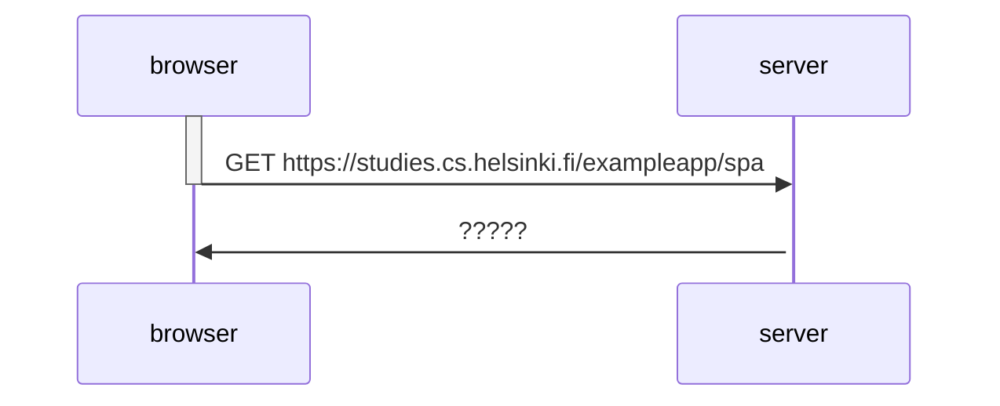

This is the answer in exercise 0.5: Single Page App 

The diagram shows what happens when a user goes in this address https://studies.cs.helsinki.fi/exampleapp/spa. 

```mermaid
sequenceDiagram
  participant browser
  participant server
  activate browser
  browser->>server: GET https://studies.cs.helsinki.fi/exampleapp/spa
  deactivate browser
  activate server
  server->>browser: ?????

```
