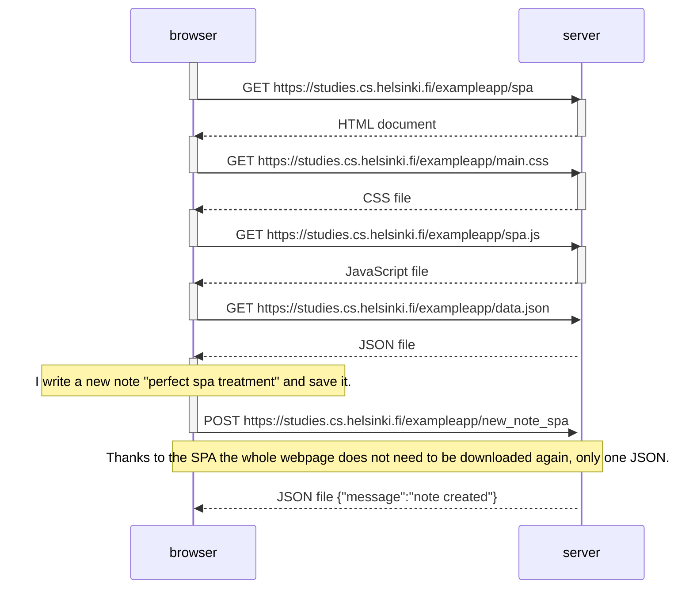

Here is the sequence diagram to the exercise 0.6. 
The chart shows what happens when a user makes a new note in this app: https://studies.cs.helsinki.fi/exampleapp/spa

```mermaid
sequenceDiagram
  participant browser
  participant server
  activate browser
  browser->>server: GET https://studies.cs.helsinki.fi/exampleapp/spa
  deactivate browser
  activate server
  server-->>browser: HTML document
  deactivate server

  activate browser
  browser->>server: GET https://studies.cs.helsinki.fi/exampleapp/main.css
  deactivate browser
  activate server
  server-->>browser: CSS file
  deactivate server

  activate browser
  browser->>server: GET https://studies.cs.helsinki.fi/exampleapp/spa.js
  deactivate browser
  activate server
  server-->>browser: JavaScript file
  deactivate server

  activate browser
  browser->>server: GET https://studies.cs.helsinki.fi/exampleapp/data.json
  deactivate browser
  activate server
  server-->>browser: JSON file

  activate browser
  Note over browser: I write a new note "perfect spa treatment" and save it.
  browser->>server: POST https://studies.cs.helsinki.fi/exampleapp/new_note_spa
  deactivate browser
  activate server
  Note over server,browser: Thanks to the SPA the whole webpage does not need to be downloaded again, only one JSON.
  server-->>browser: JSON file {"message":"note created"}
```

