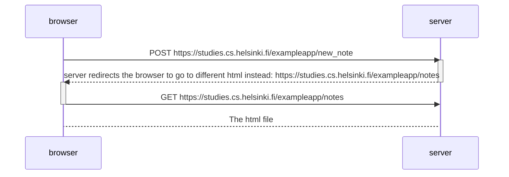

Here is the sequence diagram (https://studies.cs.helsinki.fi/exampleapp/notes):

```mermaid
sequenceDiagram
  participant browser
  participant server
  browser->>server: POST https://studies.cs.helsinki.fi/exampleapp/new_note
  activate server
  server-->>browser: server redirects the browser to go to different html instead: https://studies.cs.helsinki.fi/exampleapp/notes 
  deactivate server
  
  activate browser
  browser->>server: GET https://studies.cs.helsinki.fi/exampleapp/notes
  deactivate browser
  activate server
  server-->browser: The html file

```
